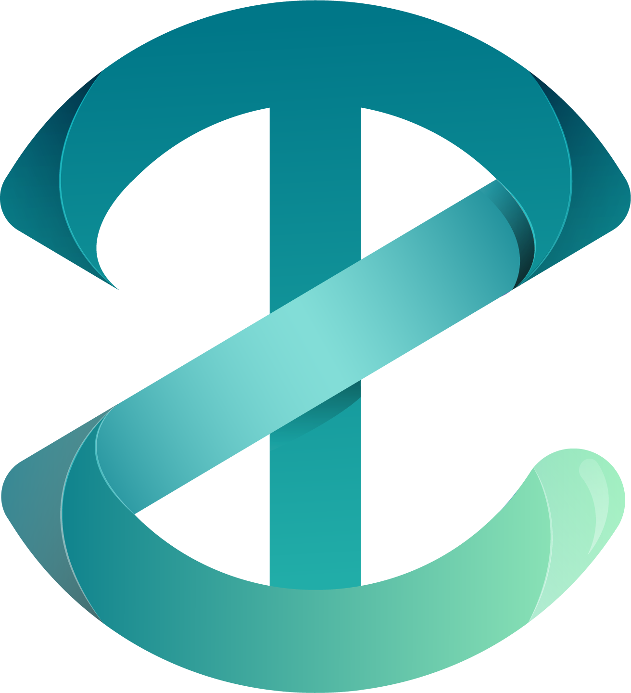

<p align="center">
  <a href="http://tech-zone.tech">
    
  </a>
</p>
<h1 align="center">
  TechZone Coding Club Website
</h1>

[](https://automate.browserstack.com/public-build/d20xTGxnNHN6eC91Zm9qMUtyV1d4dDgzUlBiMHAvcFNUT2N2ZFNkM0RzND0tLUZRclRldVFYWGUwZUE0cW96MzYzT0E9PQ==--80686c975dd5b43463a0af5b643a55984f1f92b4)

**All recent additions are located in the `develop` branch**

We are testing the site via the develop branch through netlify at the url: https://nifty-lumiere-496b16.netlify.com/

-   If you are wanting to work on this project then speak to Matt to help contribute
-   You don't have to know anything more than HTML and CSS to contribute even though this project uses much more than that.
-   This project is using Gatsby, React.js, and Typescript

## Requirements

-   **Node.js**
-   **Node Package Manager (npm)**
-   **Gatsby CLI**
    ```sh
    # Install Gatsby globally with the -g flag
    npm install -g gatsby-cli
    ```

## Quick Start

1.  **Make sure you have the requirements listed above**

2.  **Clone the repo**

    ```sh
    # Clone repo
    git clone https://gitlab.com/MrCush/techzone-website.git
    ```

3.  **Install all dependencies that are located in the `package.json` file**

    ```sh
    # Enter directory of repo and install dependencies
    cd techzone-website
    npm install
    ```

4.  **Start developing!**

    In order to start it up run:

    ```sh
    # In package.json you can see the different scripts
    npm run start
    ```

    ### **OR**

    ```sh
    # If you want to run it on your LAN so that you can watch your changes on multiple devices that are on the same network then use this command
    npm run dev-lan
    ```

    Your live server is now running at:

    **`URL:`** http://localhost:8000

    **`GraphQL:`** http://localhost:8000/___graphql

    ### **OR**

    > If you ran the dev-lan script

    **`URL:`** _your.private.local.ip_:8000

    **`GraphQL:`** _your.private.local.ip_:8000/\_\_\_graphql

    For example mine was: 192.168.7.45:8000

    **These URLs will also be printed out in the console that you ran the script on so if you're unsure what URL you should be using than simply look at your terminal**

-   If you have any other questions, just ask Matt

## If you don't know Javascript or React.js and you are looking to contribute

-   I have created a folder named `html_templates`
    -   You can choose a web page that hasn't yet been finished and write it in HTML and CSS
    -   Once done, save it in the `html_templates` folder with your CSS in the related sub-folder and submit a pull request

## Rules regarding pull requests and code formatting

1. If you are going to contribute to the actual codebase and not just provide an HTML template with a CSS file than please make sure you use ESLint and Prettier.

    - I already have `.eslintrc.json`, `.prettierrc`, and `tsconfig.json` configured. Please use them and lint your code!
    - If you need some help getting setup with ESLint, Prettier, and Typescript then I am more than willing to help out if you ask

2. If I deny your pull request, do not take it too personal. Take it as a challenge to improve. I will leave notes on what I think needs to be changed for me to accept the pull request.

3. I am using Git Flow to keep the versioning organized and clean and expect you to follow the same standards. After cloning, please make a feature branch off of the develop branch and make all of your commits there.

    - I personally suggest using the tool "GitKraken". It's completely free to use and provides an easy to use GUI for Git Flow, all your commits, and diffing files. Use whatever tool (or straight CL) you like, I just figured I'd offer a suggestion.

4. I am using GitKraken's Glow Boards to keep track of features, tasks, and anything that needs to get done for the site. If you would like to be apart of the board, let me know. This is another great reason to use the GitKraken client. There is also a VSCode extension.

## To get ahold of me

Show up to the coding club at CTU

    Friday: 3pm - 7pm Room 132B

    Saturday: 1pm - 5pm Room 139

Otherwise my email is: cushing.matt@gmail.com

The club's email is: techzonectucs@gmail.com

---

<a href="https://www.browserstack.com"></a>

Thank you to Browser Stack to supporting Open Source and allowing us to test our websites and applications free of charge on different devices. Check them out!

---

## 🎓 Learning Gatsby

Looking for more guidance? Full documentation for Gatsby lives [on the website](https://www.gatsbyjs.org/). Here are some places to start:

-   **For most developers, we recommend starting with [in-depth tutorial for creating a site with Gatsby](https://www.gatsbyjs.org/tutorial/).** It starts with zero assumptions about your level of ability and walks through every step of the process.

-   **To dive straight into code samples, head [to our documentation](https://www.gatsbyjs.org/docs/).** In particular, check out the _Guides_, _API Reference_, and _Advanced Tutorials_ sections in the sidebar.
